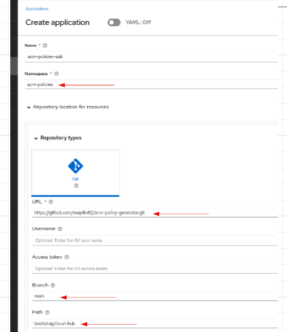
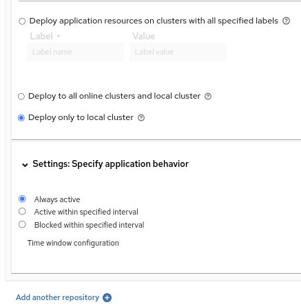

# acm-policy-generator


# Use with ACM Subscription

-   Add the user who will create the suscription to the open-cluster-management:subscription-admin rolebinding

Example:

```
apiVersion: rbac.authorization.k8s.io/v1
kind: ClusterRoleBinding
metadata:
  name: open-cluster-management:subscription-admin
roleRef:
  apiGroup: rbac.authorization.k8s.io
  kind: ClusterRole
  name: open-cluster-management:subscription-admin
subjects:
- apiGroup: rbac.authorization.k8s.io
  kind: User
  name: kube:admin
- apiGroup: rbac.authorization.k8s.io
  kind: User
  name: system:admin
```


- Provide any name for the Subscription name

- "acm-policies" as the namespace

- Path should be "bootstrap/local-hub"



Select "Deploy only to local cluster" 




# Use with ArgoCD

Please see the section "INTEGRATING WITH OPENSHIFT GITOPS (ARGOCD)" at the link https://cloud.redhat.com/blog/generating-governance-policies-using-kustomize-and-gitops to enable policy-generator plugin. 
